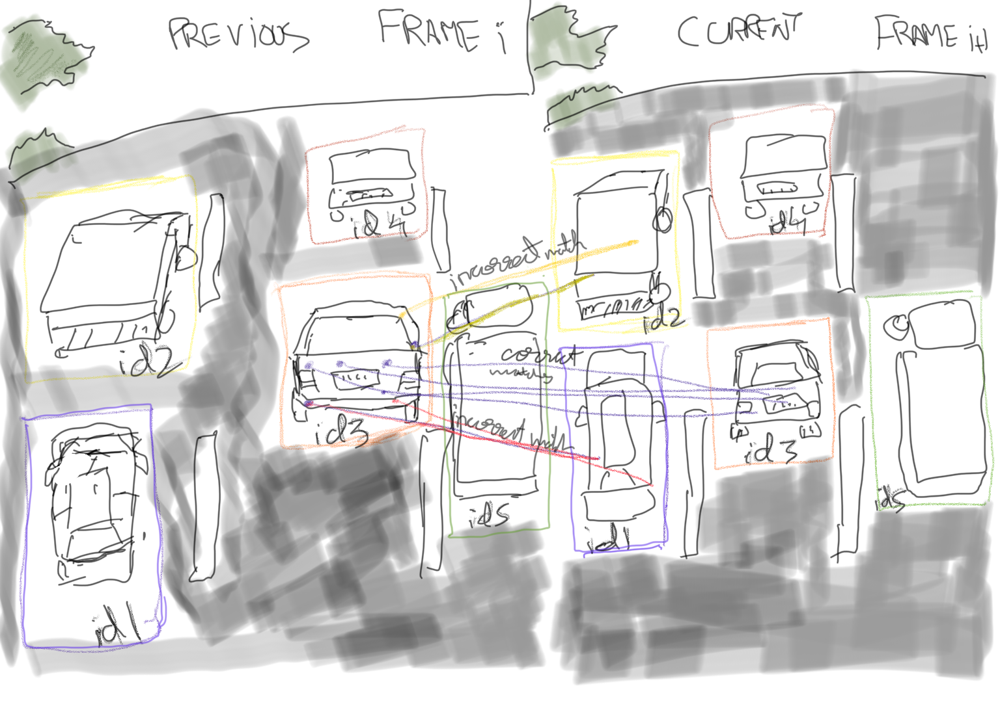
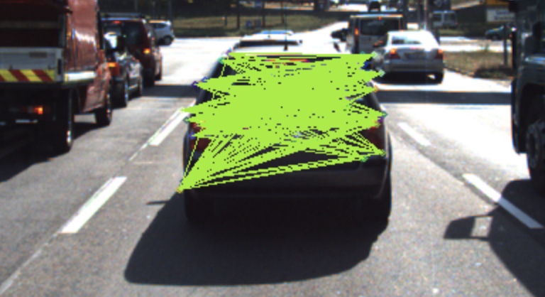
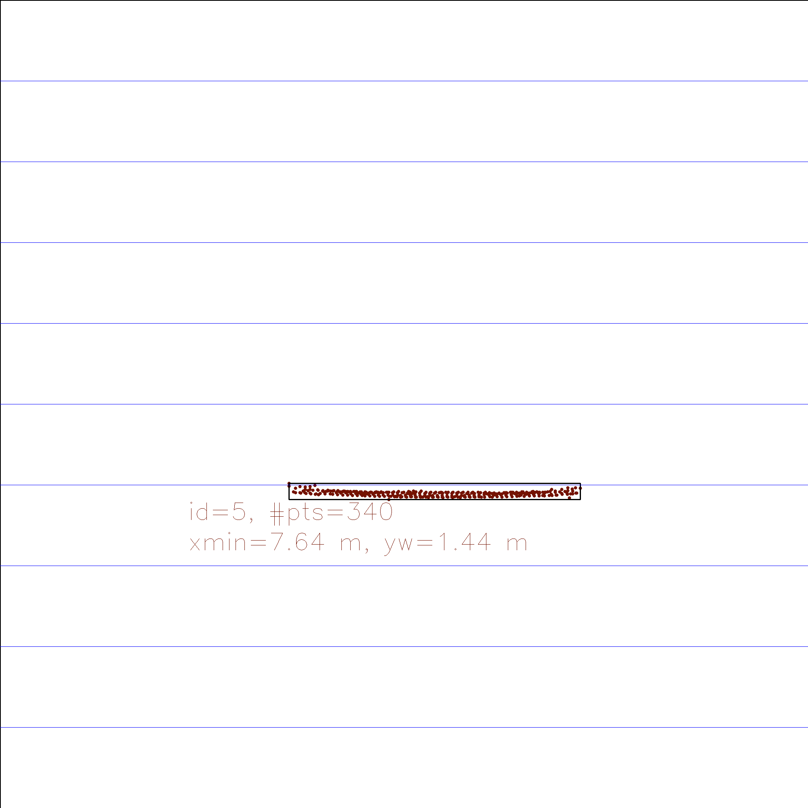
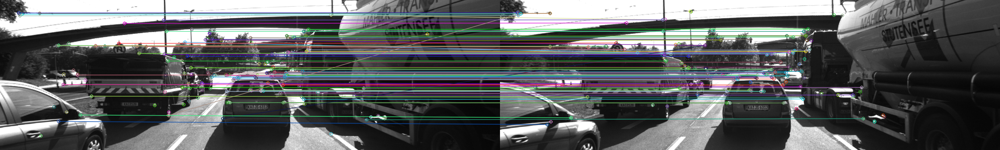
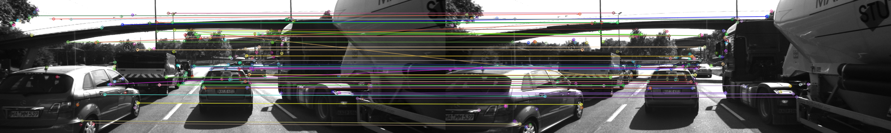

# SFND 3D Object Tracking

Welcome to the final project of the camera course. By completing all the lessons, you now have a solid understanding of keypoint detectors, descriptors, and methods to match them between successive images. Also, you know how to detect objects in an image using the YOLO deep-learning framework. And finally, you know how to associate regions in a camera image with Lidar points in 3D space. Let's take a look at our program schematic to see what we already have accomplished and what's still missing.


In this final project, you will implement the missing parts in the schematic. To do this, you will complete four major tasks: 
1. First, you will develop a way to match 3D objects over time by using keypoint correspondences. 
2. Second, you will compute the TTC based on Lidar measurements. 
3. You will then proceed to do the same using the camera, which requires to first associate keypoint matches to regions of interest and then to compute the TTC based on those matches. 
4. And lastly, you will conduct various tests with the framework. Your goal is to identify the most suitable detector/descriptor combination for TTC estimation and also to search for problems that can lead to faulty measurements by the camera or Lidar sensor. In the last course of this Nanodegree, you will learn about the Kalman filter, which is a great way to combine the two independent TTC measurements into an improved version which is much more reliable than a single sensor alone can be. But before we think about such things, let us focus on your final project in the camera course. 

## Dependencies for Running Locally
* cmake >= 2.8
  * All OSes: [click here for installation instructions](https://cmake.org/install/)
* make >= 4.1 (Linux, Mac), 3.81 (Windows)
  * Linux: make is installed by default on most Linux distros
  * Mac: [install Xcode command line tools to get make](https://developer.apple.com/xcode/features/)
  * Windows: [Click here for installation instructions](http://gnuwin32.sourceforge.net/packages/make.htm)
* Git LFS
  * Weight files are handled using [LFS](https://git-lfs.github.com/)
* OpenCV >= 4.1
  * This must be compiled from source using the `-D OPENCV_ENABLE_NONFREE=ON` cmake flag for testing the SIFT and SURF detectors.
  * The OpenCV 4.1.0 source code can be found [here](https://github.com/opencv/opencv/tree/4.1.0)
  * The OpenCV installation from source procedure can be found [here](https://docs.opencv.org/master/d7/d9f/tutorial_linux_install.html)
* gcc/g++ >= 5.4
  * Linux: gcc / g++ is installed by default on most Linux distros
  * Mac: same deal as make - [install Xcode command line tools](https://developer.apple.com/xcode/features/)
  * Windows: recommend using [MinGW](http://www.mingw.org/)

## Basic Build Instructions

1. Clone this repo.
2. Make a build directory in the top level project directory: `mkdir build && cd build`
3. Compile: `cmake .. && make`
4. Run it: `./3D_object_tracking`.
5. Install Yolo Weights the actual file from https://pjreddie.com/darknet/yolo/

## Output/Outcome Video(Using entire image sequence 77 frames)
### Assumptions
* Constant velocity model used to measure Time to collision using Lidar points
* Distance between lidar origin and the front bumper of the ego car while calculating Time to collision using Lidar   points is ignored.
* Curvature of rear bumper of the preceding vehicle not taken in consideration while calculating Time to collision using Lidar   points

   

At the end of the frame sequence, TTC calculations for both Lidar and Camera are way off due to miss detection and wrong detection of the preceding vehicle as the preceding vehicle is way closer to the ego vehicle, hence some of the features of the car detections are not visible leading to miss detection by the yolo network. Lidar points too are orange coloured(indicating the near vicinity) and some green points covering the side mirrors of the preceding vehicle as the setting for the crop lidar point gets misaligned, interferes with the Lidar based TTC calculation.


## Rubric/Objective of this project 

### Matching 3D objects
1. Implement matchBoundingBox function which takes both previous and current frames and match the region of interests those are bounding boxes returned by the yolo object detection trained network, the match and id(BoxID) assignment is based on the bounding matched pair with highest keypoint correspondences.
   

   ```cpp 
              void matchBoundingBoxes(std::vector<cv::DMatch> &matches, std::map<int, int> &bbBestMatches, DataFrame &prevFrame, DataFrame &currFrame)
        {
            // ...
            double matching_time = (double)cv::getTickCount();
            int pre = prevFrame.boundingBoxes.size();
            int cur = currFrame.boundingBoxes.size();
            int pt_counts[pre][cur] = { };
            for(auto match: matches)
            {
                cv::KeyPoint Query = prevFrame.keypoints[match.queryIdx];
                cv::KeyPoint Train = currFrame.keypoints [match.trainIdx];
                auto Query_point = cv::Point(Query.pt.x, Query.pt.y);
                auto Train_point = cv::Point(Train.pt.x, Train.pt.y);
                bool Query_found = false, Train_found = false;
                
                std::vector<int> Query_boxes_id, Train_boxes_id;
                
                for (int i = 0; i < pre; i++) 
                {
                    if (prevFrame.boundingBoxes[i].roi.contains(Query_point))            
                    {
                        Query_found = true;
                        Query_boxes_id.push_back(i);
                    }
                }
                for (int i = 0; i < cur; i++) 
                {
                    if (currFrame.boundingBoxes[i].roi.contains(Train_point))            
                    {
                        Train_found= true;
                        Train_boxes_id.push_back(i);
                    }
                }

                if (Query_found && Train_found) 
                {
                    for (auto id_prev: Query_boxes_id)
                        for (auto id_curr: Train_boxes_id)
                            pt_counts[id_prev][id_curr] += 1;
                }
                
            }


            for (int i = 0; i < pre; i++)
            {  
                int max_count = 0;
                int id_max = 0;
                for (int k = 0; k < cur; k++)
                    if (pt_counts[i][k] > max_count)
                    {  
                          max_count = pt_counts[i][k];
                          id_max = k;
                    }
                bbBestMatches[i] = id_max;
            }

            matching_time = ((double)cv::getTickCount() - matching_time) / cv::getTickFrequency();
            cout << " match bounding box took " << 1000 * matching_time / 1.0 << " ms.\n";
        }
   ```

### Compute Lidar-based TTC
2. Compute time to collision with the preceding vehicle, for the bounding box matches returned by matchBoundingBox function only using projections of the 3D lidarpoints on the Image plane.

  


[These figures refers to Udacity]

    ```cpp
        void computeTTCLidar(std::vector<LidarPoint> &PrevlidarPoints,
                            std::vector<LidarPoint> &CurrlidarPoints, double frameRate, double &TTC)
        {
            double ttc_lidar_calculation_time = (double)cv::getTickCount();

            // For each current and previous frame, taking the median point of the lidar points for the distance estimation  
            // If the performance is suffering due to the median calculation for the entire lidarpoint dataset, take the median of the subset of the lidarpoints 
            sort_lidarpoints_inX(PrevlidarPoints);
            sort_lidarpoints_inX(CurrlidarPoints);
            
            double d0 = PrevlidarPoints.size() % 2 == 0 ? (PrevlidarPoints[(PrevlidarPoints.size()/2) - 1].x + PrevlidarPoints[PrevlidarPoints.size()/2].x) / 2.0 : PrevlidarPoints[PrevlidarPoints.size()/2].x; // compute median lidarpoint to remove outlier influence
            //double d0 = PrevlidarPoints[PrevlidarPoints.size()/2].x;
            //double d1 = CurrlidarPoints[CurrlidarPoints.size()/2].x;
            double d1 = CurrlidarPoints.size() % 2 == 0 ? (CurrlidarPoints[(CurrlidarPoints.size()/2) - 1].x + CurrlidarPoints[CurrlidarPoints.size()/2].x) / 2.0 : CurrlidarPoints[CurrlidarPoints.size()/2].x; // compute median lidarpoint to remove outlier influence

            // This calculation is based on the constant velocity model(However, constant acceleration and more complex models are realistic)
            // TTC = d1 * delta_t / (d0 - d1)
            // where: d0 is the previous frame's distance from the ego car to the preceding vehicle's rear bumper 
            //        d1 is the current frame's distance from the ego car to the preceding vehicle's rear bumper 
            //        delta_t is the time difference between two consecutive frames (1 / frameRate)
            // Note: this implementation of the time to collision using Lidar points doesn't take the distance between the Lidar origin and the ego vehicles front bumper! in account
            // It also does not account the hump caused due to the curvature of the rear bump of the preceding vehicle.
            TTC = d1 * (1.0 / frameRate) / (d0 - d1);

            ttc_lidar_calculation_time = ((double)cv::getTickCount() - ttc_lidar_calculation_time) / cv::getTickFrequency();
            cout << " ttc lidar calculation took " << 1000 * ttc_lidar_calculation_time / 1.0 << " ms.\n";
        }
  
    ```

### Associate Keypoint Correspondences with Bounding Boxes
3. Preparing the data for Camera based time to collision by associating keypoint correspondences those lie in the bounding box or the region of interest in both current and previous frame along with their distance being less than a certain threshold.

 

[These figures refers to Udacity]

```cpp
        // associate a given bounding box with the keypoints it contains
      void clusterKptMatchesWithROI(BoundingBox &boundingBox_c, BoundingBox &boundingBox_p, std::vector<cv::KeyPoint> &kptsPrev, std::vector<cv::KeyPoint> &kptsCurr, std::vector<cv::DMatch> &kptMatches)
      {
          // ...
          double dist_mean = 0;
          vector<cv::DMatch>  kptMatches_roi;

          float shrink_factor = 0.15;
          cv::Rect smaller_box_c, smaller_box_p;
          // shrinking current frame bounding box to avoid having outlier points around the edges
          smaller_box_c.x = boundingBox_c.roi.x + shrink_factor * boundingBox_c.roi.width / 2.0;
          smaller_box_c.y = boundingBox_c.roi.y + shrink_factor * boundingBox_c.roi.height / 2.0;
          smaller_box_c.width = boundingBox_c.roi.width * (1 - shrink_factor);
          smaller_box_c.height = boundingBox_c.roi.height * (1 - shrink_factor);

          // shrinking previous frame bounding box slightly to avoid having outlier points around the edges
          smaller_box_p.x = boundingBox_p.roi.x + shrink_factor * boundingBox_p.roi.width / 2.0;
          smaller_box_p.y = boundingBox_p.roi.y + shrink_factor * boundingBox_p.roi.height / 2.0;
          smaller_box_p.width = boundingBox_p.roi.width * (1 - shrink_factor);
          smaller_box_p.height = boundingBox_p.roi.height * (1 - shrink_factor);

          //getting the matches located within  current_frame_boundingBox and previous_frame_boundingBox
          for(auto kptmatch:kptMatches)
          {
              cv::KeyPoint Train = kptsCurr.at(kptmatch.trainIdx);
              auto Train_point = cv::Point(Train.pt.x, Train.pt.y);

              cv::KeyPoint Query = kptsPrev.at(kptmatch.queryIdx); 
              auto Query_point = cv::Point(Query.pt.x, Query.pt.y);

              // checking whether the point is inside the shrinked bounding box in both previous and current frames
              if (smaller_box_c.contains(Train_point) && smaller_box_p.contains(Query_point)) 
                  kptMatches_roi.push_back(kptmatch);           
          }

          //Mean of all distances between the match points pairs from previous and current frame 
          for(auto kptMatch_roi:kptMatches_roi)
          {
              dist_mean += cv::norm(kptsCurr.at(kptMatch_roi.trainIdx).pt - kptsPrev.at(kptMatch_roi.queryIdx).pt); 
          }
          if(kptMatches_roi.size() > 0)
              dist_mean = dist_mean/kptMatches_roi.size();
          else return;

          //keep the matches  distance < dist_mean * 1.5
          double threshold = dist_mean*1.5;
          for  (auto kptMatch_roi:kptMatches_roi)
          {
            float dist = cv::norm(kptsCurr.at(kptMatch_roi.trainIdx).pt - kptsPrev.at(kptMatch_roi.queryIdx).pt);
            if (dist< threshold)
                boundingBox_c.kptMatches.push_back(kptMatch_roi);
          }

          cout<<"curr_bbx_matches_size: "<<boundingBox_c.kptMatches.size()<<endl;
      }

```

### Compute Camera-based TTC
4. Compute time to collision with the preceding vehicle, for the bounding box matches returned by matchBoundingBox function only using the keypoint correspondences assosiated with bounding box/region of interest of preceding vehicle

 

[These figures refers to Udacity]

```cpp
        // Compute time-to-collision (TTC) based on keypoint correspondences in successive images
      void computeTTCCamera(std::vector<cv::KeyPoint> &kptsPrev, std::vector<cv::KeyPoint> &kptsCurr, 
                            std::vector<cv::DMatch> kptMatches, double frameRate, double &TTC, cv::Mat *visImg)
      {
          // ...
          vector<double> distRatios; // will store the distance ratios between all the keypoint matches in current frame and previous frame 
          for (auto it1 = kptMatches.begin(); it1 != kptMatches.end() - 1; ++it1)
          {
              cv::KeyPoint OuterkpCurr = kptsCurr.at(it1->trainIdx);
              cv::KeyPoint OuterkpPrev = kptsPrev.at(it1->queryIdx);
            
              for (auto it2 = it1 + 1; it2 != kptMatches.end(); ++it2)
              {  
                  double minDist = 100.0; // min. required distance
                  cv::KeyPoint InnerkpCurr = kptsCurr.at(it2->trainIdx);
                  cv::KeyPoint InnerkpPrev = kptsPrev.at(it2->queryIdx);
                  // computing distances between all possible keypoints from the given keypoint
                  double dist_Curr = cv::norm(OuterkpCurr.pt - InnerkpCurr.pt);
                  double dist_Prev = cv::norm(OuterkpPrev.pt - InnerkpPrev.pt);
                  if (dist_Prev > std::numeric_limits<double>::epsilon() && dist_Curr >= minDist)
                  { // avoid division by zero
                      double distRatio = dist_Curr / dist_Prev;
                      distRatios.push_back(distRatio);//computing distances ratios
                  }
              }
          }  
          // continue only if the distRatios have atleast one pair
          if (distRatios.size() == 0)
          {
              TTC = NAN;
              return;
          }

          sort(distRatios.begin(), distRatios.end());

          long median_Index = floor(distRatios.size() / 2.0);
          double median_DistRatio = distRatios.size() % 2 == 0 ? (distRatios[median_Index - 1] + distRatios[median_Index]) / 2.0 : distRatios[median_Index]; // computing median distance ratio to remove anomally

          double dT = 1 / frameRate;
          TTC = -dT / (1 - median_DistRatio);
      }
```
### Performance 

### Observation of Lidar TTC and Camera TTC for only first 18 frames for selected Detector & Descriptor Combinations
Frame No.|FAST&BRISK|FAST&BRIEF|SHITOMASI&BRIEF|BRISK&BRISK|BRISK&BRIEF|
|----------|----------|----------|----------|----------|----------|
|1|<ul><li>LiDAR TTC:  12.515s</li><li>Camera TTC: 11.533s </li></ul>|<ul><li>LiDAR TTC: 12.515s</li><li>Camera TTC: 11.533s</li></ul>|<ul><li>LiDAR TTC: 12.515s</li><li>Camera TTC: 10.956s</li></ul>|<ul><li>LiDAR TTC: 12.515s</li><li>Camera TTC: 22.310s</li></ul>|<ul><li>LiDAR TTC: 12.515s</li><li>Camera TTC: 17.320s</li></ul>|
|2|<ul><li>LiDAR TTC: 12.614s</li><li>Camera TTC: 11.867s</li></ul>|<ul><li>LiDAR TTC: 12.614s</li><li>Camera TTC: 12.083s</li></ul>|<ul><li>LiDAR TTC: 12.614s</li><li>Camera TTC: 13.317s</li></ul>|<ul><li>LiDAR TTC: 12.614s</li><li>Camera TTC: 44.961s</li></ul>|<ul><li>LiDAR TTC: 12.614s</li><li>Camera TTC: 20.830s</li></ul>|
|3|<ul><li>LiDAR TTC: 14.091s</li><li>Camera TTC: 13.501s</li></ul>|<ul><li>LiDAR TTC: 14.091s</li><li>Camera TTC: 10.911s</li></ul>|<ul><li>LiDAR TTC: 14.091s</li><li>Camera TTC: 11.629s</li></ul>|<ul><li>LiDAR TTC: 14.091s</li><li>Camera TTC: 14.629s</li></ul>|<ul><li>LiDAR TTC:14.091s</li><li>Camera TTC: 14.474s</li></ul>|
|4|<ul><li>LiDAR TTC: 16.689s</li><li>Camera TTC: 12.632s</li></ul>|<ul><li>LiDAR TTC: 16.689s</li><li>Camera TTC: 12.910s</li></ul>|<ul><li>LiDAR TTC: 16.689s</li><li>Camera TTC: 12.186s</li></ul>|<ul><li>LiDAR TTC: 16.689s</li><li>Camera TTC: 21.575s</li></ul>|<ul><li>LiDAR TTC: 16.689s</li><li>Camera TTC: 14.450s</li></ul>|
|5|<ul><li>LiDAR TTC: 15.746s</li><li>Camera TTC: 65.907s</li></ul>|<ul><li>LiDAR TTC: 15.746s</li><li>Camera TTC: -infs</li></ul>|<ul><li>LiDAR TTC: 15.746s</li><li>Camera TTC: 12.139s</li></ul>|<ul><li>LiDAR TTC: 15.746s</li><li>Camera TTC: 32.368s</li></ul>|<ul><li>LiDAR TTC:15.746s</li><li>Camera TTC: 13.112s</li></ul>|
|6|<ul><li>LiDAR TTC: 12.783s</li><li>Camera TTC: -infs</li></ul>|<ul><li>LiDAR TTC: 12.783s</li><li>Camera TTC: -infs</li></ul>|<ul><li>LiDAR TTC: 12.783s</li><li>Camera TTC: -infs</li></ul>|<ul><li>LiDAR TTC: 12.783s</li><li>Camera TTC: 48.110s</li></ul>|<ul><li>LiDAR TTC: 12.783s</li><li>Camera TTC: 28.530s</li></ul>|
|7|<ul><li>LiDAR TTC: 11.984s</li><li>Camera TTC: 12.177s</li></ul>|<ul><li>LiDAR TTC: 11.984s</li><li>Camera TTC: 12.320s</li></ul>|<ul><li>LiDAR TTC: 11.984s</li><li>Camera TTC: 12.413s</li></ul>|<ul><li>LiDAR TTC: 11.984s</li><li>Camera TTC: 20.049s</li></ul>|<ul><li>LiDAR TTC: 11.984s</li><li>Camera TTC: 18.549s</li></ul>|
|8|<ul><li>LiDAR TTC: 13.124s</li><li>Camera TTC: NANs</li></ul>|<ul><li>LiDAR TTC: 13.124s</li><li>Camera TTC: 10.974s</li></ul>|<ul><li>LiDAR TTC: 13.124s</li><li>Camera TTC: 17.426s</li></ul>|<ul><li>LiDAR TTC: 13.124s</li><li>Camera TTC: 24.864s</li></ul>|<ul><li>LiDAR TTC: 13.124s</li><li>Camera TTC: 25.215s</li></ul>|
|9|<ul><li>LiDAR TTC: 13.024s</li><li>Camera TTC: -infs</li></ul>|<ul><li>LiDAR TTC: 13.024s</li><li>Camera TTC: -infs</li></ul>|<ul><li>LiDAR TTC: 13.024s</li><li>Camera TTC: NANs</li></ul>|<ul><li>LiDAR TTC: 13.024s</li><li>Camera TTC: 25.388s</li></ul>|<ul><li>LiDAR TTC: 13.024s</li><li>Camera TTC: 18.095s</li></ul>|
|10|<ul><li>LiDAR TTC: 11.175s</li><li>Camera TTC: -infs</li></ul>|<ul><li>LiDAR TTC: 11.175s </li><li>Camera TTC: 10.946s</li></ul>|<ul><li>LiDAR TTC: 11.175s</li><li>Camera TTC: -infs</li></ul>|<ul><li>LiDAR TTC: 11.175s</li><li>Camera TTC: 11.910s</li></ul>|<ul><li>LiDAR TTC: 11.175s</li><li>Camera TTC: 13.956s</li></ul>|
|11|<ul><li>LiDAR TTC: 12.808s</li><li>Camera TTC: 11.231s</li></ul>|<ul><li>LiDAR TTC: 12.808s</li><li>Camera TTC: 28.713s</li></ul>|<ul><li>LiDAR TTC: 12.808s</li><li>Camera TTC: 11.201s</li></ul>|<ul><li>LiDAR TTC: 12.808s</li><li>Camera TTC: 14.727s</li></ul>|<ul><li>LiDAR TTC: 12.808s</li><li>Camera TTC: 17.619s</li></ul>|
|12|<ul><li>LiDAR TTC: 8.959s</li><li>Camera TTC: 10.726s</li></ul>|<ul><li>LiDAR TTC: 8.959s</li><li>Camera TTC: 11.017s</li></ul>|<ul><li>LiDAR TTC: 8.959s</li><li>Camera TTC: 11.596</li></ul>|<ul><li>LiDAR TTC: 8.959s</li><li>Camera TTC: 13.267s</li></ul>|<ul><li>LiDAR TTC: 8.959s</li><li>Camera TTC: 12.819s</li></ul>|
|13|<ul><li>LiDAR TTC: 9.964s</li><li>Camera TTC: 11.795s</li></ul>|<ul><li>LiDAR TTC: 9.964s</li><li>Camera TTC: 11.482s</li></ul>|<ul><li>LiDAR TTC: 9.964s</li><li>Camera TTC: 11.726s</li></ul>|<ul><li>LiDAR TTC: 9.964s</li><li>Camera TTC: 14.656s</li></ul>|<ul><li>LiDAR TTC: 9.964s</li><li>Camera TTC: 17.339s</li></ul>|
|14|<ul><li>LiDAR TTC: 9.598s</li><li>Camera TTC: -infs</li></ul>|<ul><li>LiDAR TTC: 9.598s</li><li>Camera TTC: -infs</li></ul>|<ul><li>LiDAR TTC: 9.598s</li><li>Camera TTC: 11.878s</li></ul>|<ul><li>LiDAR TTC: 9.598s</li><li>Camera TTC: 17.431s</li></ul>|<ul><li>LiDAR TTC: 9.598s</li><li>Camera TTC: 11.613s</li></ul>|
|15|<ul><li>LiDAR TTC: 8.521s</li><li>Camera TTC: 13.271s</li></ul>|<ul><li>LiDAR TTC: 8.521s</li><li>Camera TTC: 13.550s</li></ul>|<ul><li>LiDAR TTC: 8.521s</li><li>Camera TTC: </li></ul>|<ul><li>LiDAR TTC: 8.521s</li><li>Camera TTC:17.650s</li></ul>|<ul><li>LiDAR TTC: 8.521s</li><li>Camera TTC: 17.659s</li></ul>|
|16|<ul><li>LiDAR TTC: 9.515s</li><li>Camera TTC: 13.248s</li></ul>|<ul><li>LiDAR TTC: 9.515s</li><li>Camera TTC: 11.850s</li></ul>|<ul><li>LiDAR TTC: 9.515s</li><li>Camera TTC: 10.629s</li></ul>|<ul><li>LiDAR TTC: 9.515s</li><li>Camera TTC: 12.696s</li></ul>|<ul><li>LiDAR TTC: 9.515s</li><li>Camera TTC: 12.271s</li></ul>|
|17|<ul><li>LiDAR TTC: 9.612s</li><li>Camera TTC: 10.800s</li></ul>|<ul><li>LiDAR TTC: 9.612s</li><li>Camera TTC: 10.320s</li></ul>|<ul><li>LiDAR TTC: 9.612s</li><li>Camera TTC: 11.303s</li></ul>|<ul><li>LiDAR TTC: 9.612s</li><li>Camera TTC:12.997s</li></ul>|<ul><li>LiDAR TTC: 9.612s</li><li>Camera TTC: 10.858s</li></ul>|
|18|<ul><li>LiDAR TTC: 8.399s</li><li>Camera TTC: 12.306s</li></ul>|<ul><li>LiDAR TTC: 8.399s</li><li>Camera TTC: 156.74s</li></ul>|<ul><li>LiDAR TTC: 8.399s</li><li>Camera TTC: 11.871s</li></ul>|<ul><li>LiDAR TTC: 8.399s</li><li>Camera TTC: 18.978</li></ul>|<ul><li>LiDAR TTC: 8.399s</li><li>Camera TTC: 16.281s</li></ul>|


### Anomaly based on Lidar TTC calculations 
#### Observations
* For frame 4 it gives a little overshoot 16.689 seconds from 12 to 13 seconds. This could be because median filter being used to remove the outliers could fail in certain scenarios where the median value itself is the outlier and don not lie on the exact rear bumper of the preceding car.

  

[This right figure refers to Udacity]
### Anomaly based on Camera TTC calculations
#### Observations
* For last frame in the calculation sequence that is frame 18(For FAST & BRIEF combination) with 156.74 seconds  and frame 5(FAST & BRISK combination) with 65.094 seconds. The reason could be the incorrect matches that somehow lie inside the bounding box enclosing the preceding vehicle/ROI.

  

### NANs and -infs returned by Camera TTC calculations
* Reason for this comes from the logic of computeTTCCamera() function. One reason could be distribution of the keypoints do not meet the threshold criteria and don't qualify to be in the vector of distRatios required for the final Camera based TTC calculations.

```cpp
if (distRatios.size() == 0)
{
    TTC = NAN;
    return;
}

```
